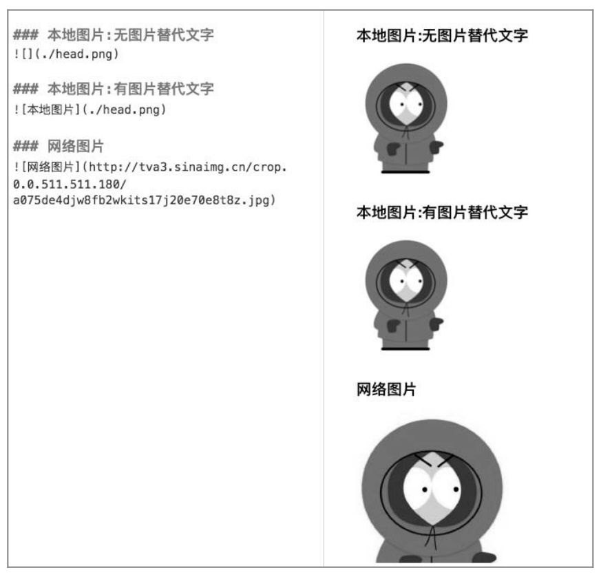

# Markdown

## 为何使用Markdown

- Markdown 是一种轻量级的标记语言，使用纯文本格式编写文档，便于阅读和编写。
- 用于更方便的做笔记
- Markdown 语法简单，易于学习和使用。

## 常用语法

- 列表 '-'
  - 第二层列表  
    1.序号列表
  - 嵌套列表

- 图片  
  
  

- link
  
    [google](https://www.google.com)

- 超链接  

  <2772831764@qq.com>

- 代码
  
  - 行内代码 `cd ..`
  - 代码块

```python
  def test_print():
  pass
```

```C++
#include<iostream>

```

- 引用

>美是到处都有的

- 转义


- ~~删除线~~

- emoji 😊

- 表格

| 表头1 | 表头2 | 表头3 |
|:------ |  ------: | :------: |
| 左对齐 | 右对齐 | 居中对齐 |

- mission

- [ ] 未勾选
- [x] 已勾选
  